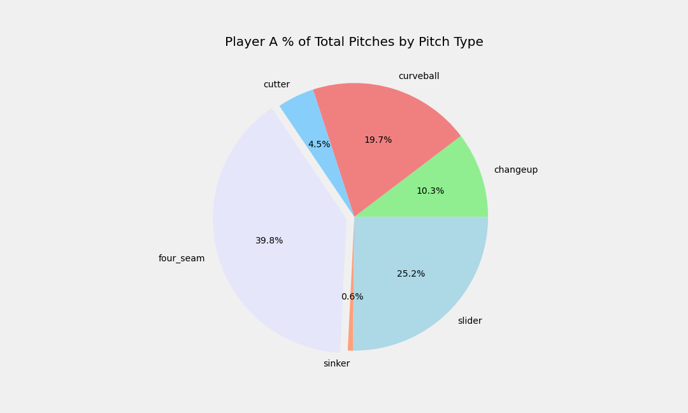
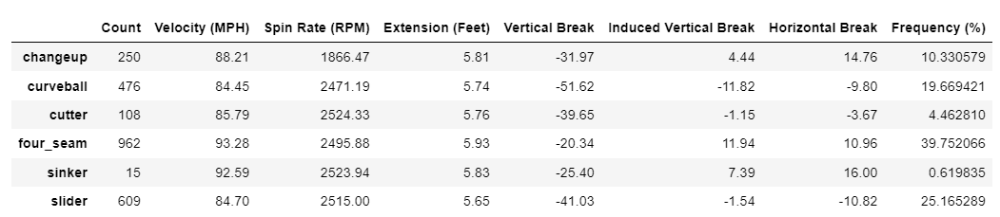
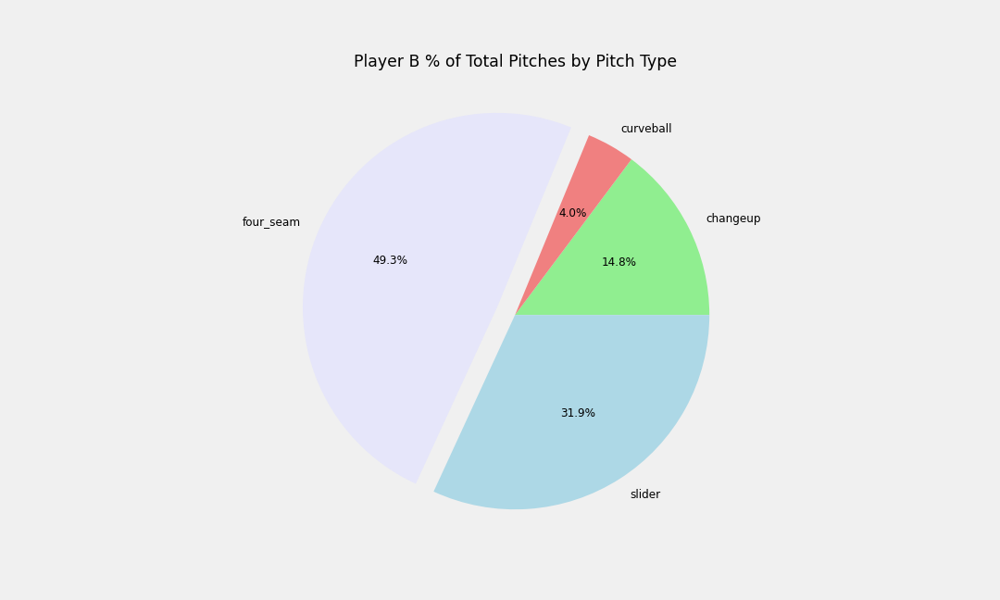
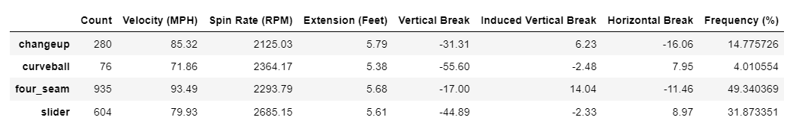

# BaseballPlayerAnalysis

## Overview

The purpose of this analysis is to provide information on two new pitchers for the coaches to review. The raw pitch data is provided in a excel file in CSV format, loaded into Python Jupyter Notebook, explored using pandas dataframes and visualized using matplotlib.

## Player A

Player A is working with an arsenal of six pitches. His go-to pitch is a 93 MPH four-seam fastball that he throws at a 39.8% frequency. He has a good distribution off-speed pitches primarily consisting of a slider, curveball and changeup thrown as a frequency of 25.2%, 19.7% and 10.3%, repectively. Player A will also mix in a cutter and slider at a frequency of 4.5% and 0.6%, respectively. 

## Player B

Player B is working with an arsenal of four pitches. His go-to pitch is a 93 MPH four-seam fastball that he throws at a 39.8% frequency. He has a good distribution off-speed pitches primarily consisting of a slider, curveball and changeup thrown as a frequency of 25.2%, 19.7% and 10.3%, repectively. Player B will also mix in a cutter and slider at a frequency of 4.5% and 0.6%, respectively. 

## Recommendation
- 
- 
- 

Additional analysis options to include:
